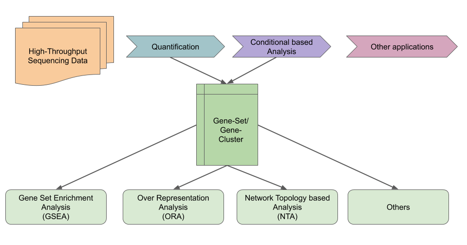
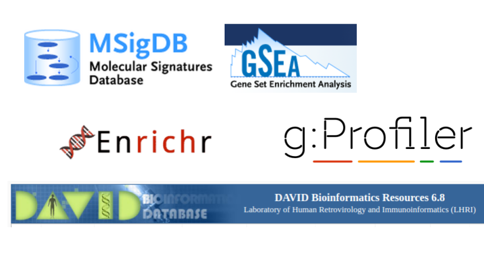
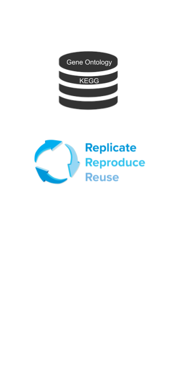
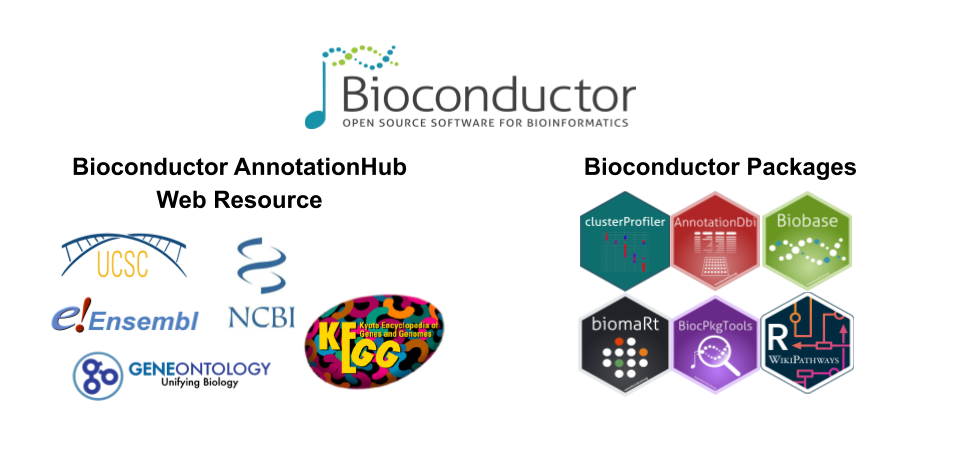
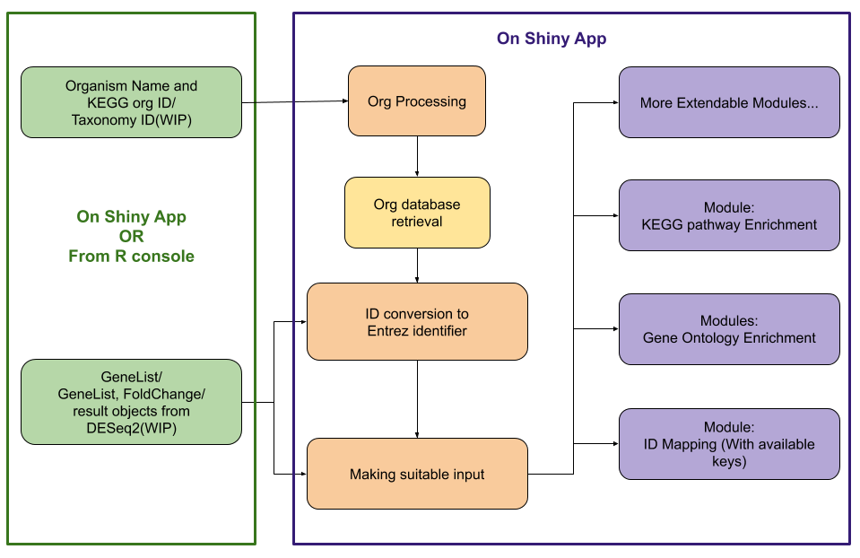
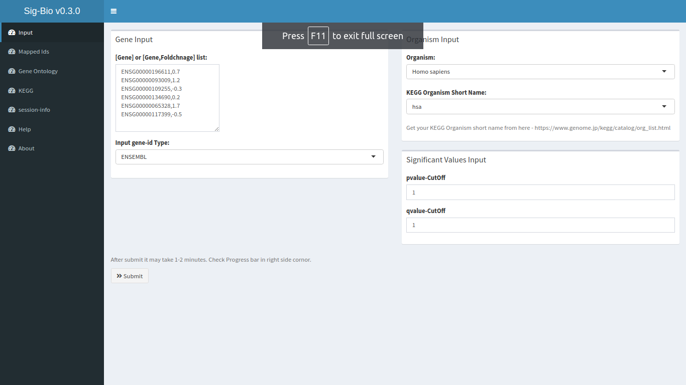
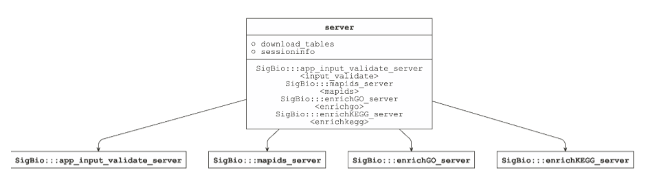

layout: true

<div class="my-footer"><span>
https://sksahu.net/sigbio-shiny-slides    
&emsp;&emsp;&emsp;&emsp;&emsp;&emsp;&emsp;&emsp;&emsp;</span></div> 

---

# Outlines

- What is detecting Biological Significance on a GeneSet means?
- Some of available resources
- Ideal scenarios for a GeneSet analysis
- SigBio-Shiny Overview
- Features
- Usage
- Screenshots/Demo
- Modular Design for developers

---

# Biological Significance on a GeneSet


---

# Some of available resources 



---

# Ideal scenarios for a GeneSet analysis

.pull-left[
- An organism database
  - From **Up-to-date resources**
  - Support for **model and non-model organisms/species**
- Reproducibility
  - Keeping track of **Database version**
  - Statistical iterations log
- Accessibility
  - **Programmatic access** alongside GUI
  - Result interpretability with **plots**

***While most available resources support some of above criteria but not all.***

]

.pull-right[

]

---

# SigBio-Shiny Overview

SigBio-Shiny provides a standalone R-Shiny based GUI application for doing such GeneSet based analysis. Build on top of already available **open-source infrastructure**, Such as - 


---

# SigBio-Shiny Structure



---

# SigBio-Shiny Features

- Run time **downloading of selected organism database** with keeping a log for reproducibility. (with [AnnotationHub])
- **Gene ID mapping** from different database. (with [AnnotationDbi])
- **Gene Ontology Enrichment** (with [clusterProfiler])
- **KEGG pathway Enrichment** (with [clusterProfiler])
- Visualization of **genes in KEGG pathway** (with [pathview])
- Different **enrichment plots** (with [enrichplot])

[AnnotationHub]: https://bioconductor.org/packages/release/bioc/html/AnnotationHub.html
[clusterProfiler]: https://bioconductor.org/packages/release/bioc/html/clusterProfiler.html
[pathview]: https://bioconductor.org/packages/release/bioc/html/pathview.html
[enrichplot]: https://www.bioconductor.org/packages/release/bioc/html/enrichplot.html

## Work in progress

- Directly launch with R objects from certain packages like DESeq2
- Complete **reproducible R-script** in the end of an analysis.

---

# SigBio-Shiny Usage

- Download as **R-package** and launch into browser directly from R console 

```{r, eval=FALSE}
remotes::install_github("sk-sahu/sig-bio-shiny") # Install the package
SigBio::runApp() # Load the shiny application in browser
SigBio::runApp(res) # work in progress
```

- Download as a **single R-script** for Shiny-Server deploy 

```{bash, eval=FALSE}
wget https://raw.githubusercontent.com/sk-sahu/sig-bio-shiny/master/inst/app/app.R -O sig-bio-shiny-app.R
```

- Also can be run from a readily available **docker container**.

```{bash, eval=FALSE}
docker pull sudosk/sig-bio-shiny:latest
docker run --user shiny --rm -p 80:3838 sudosk/sig-bio-shiny:latest

```

---

# SigBio-Shiny Demo

<div style="position: relative; padding-bottom: 56.25%; height: 0; overflow: hidden;">
<iframe src="https://www.youtube.com/embed/Ij-pPLaXUAc" style="position: absolute; top: 0; left: 0; width: 100%; height: 90%; border:0;" allowfullscreen></iframe>
</div>

---

# SigBio-Shiny New UI



---

# SigBio-Shiny Modular Design



Build on a modular approach such that adding a new package/functionality is easy for a developers.

---

.center[
# Thank you 
]

Project Github - https://github.com/sk-sahu/sig-bio-shiny/

Open to Feedback or Contributions

- [Project's GitHub Issue section](https://github.com/sk-sahu/sig-bio-shiny/issues) 

- [Project's Gitter chat room](https://gitter.im/sig-bio-shiny/community)

- Or directly reach me on twitter [@sangram_ksahu](https://twitter.com/sangram_ksahu)

This Side URL: [https://sksahu.net/sigbio-shiny-slide](https://sksahu.net/sigbio-shiny-slides)

